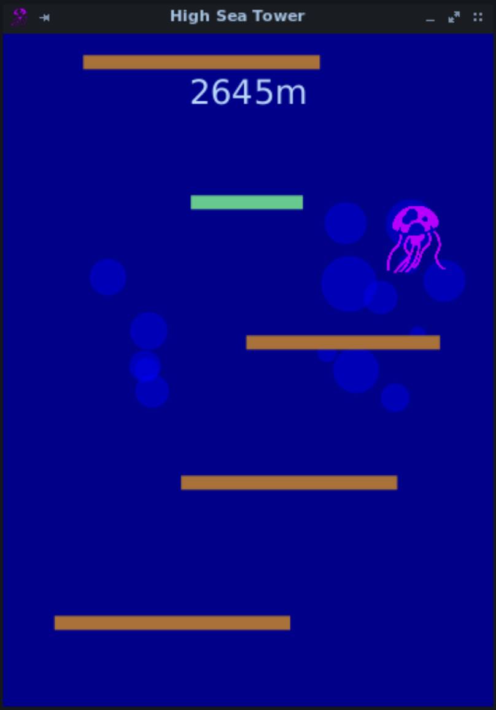

# High Sea Tower

High Sea Tower is a JavaFX Desktop game in which a medusa must jump from platform to platform in order to stay away fron the moving bottom of the screen. The higher it goes, the higher the score. Platforms behave differently depending on their color. Some cannot be crossed, while some others make the game go faster for instance.
This project was part of the IFT1025 course I took at Université de Montréal in 2020.

